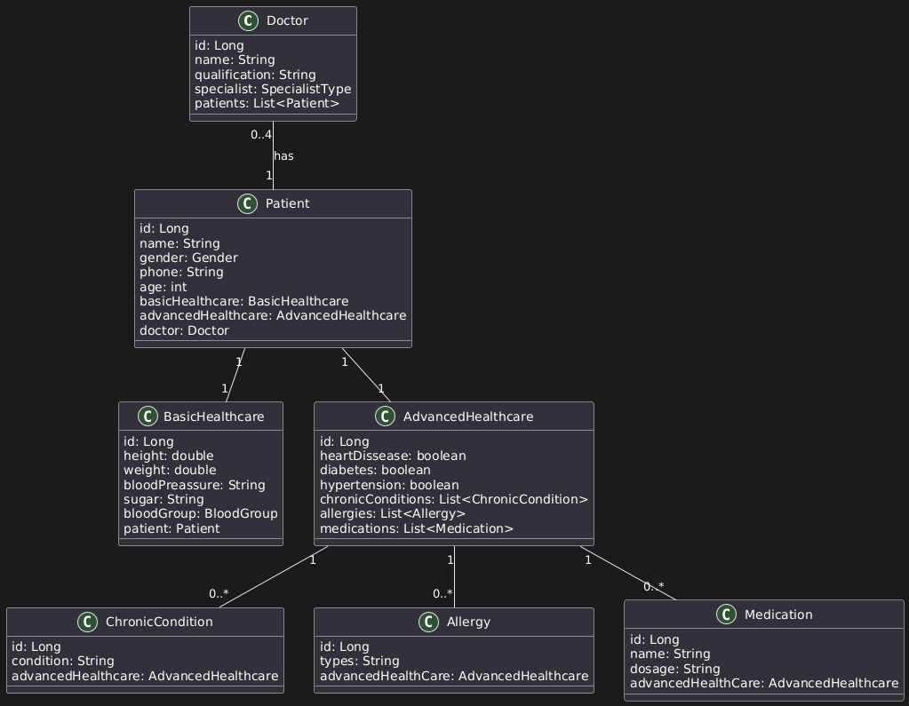

# Doctor Patient REST Service

### Objective

The **Doctor Patient REST Service** is a Spring boot based application designed to manage doctors and patients with fundamental CRUD operations. This demo aims to showcase the implementation of key backend functionalities, Entity Relationships, and best practices in REST API development.

### Tech Stack

* **Spring Boot** as the core framework
* **Maven** for dependency management
* **H2 (in-memory)/Postgresql** as the database
* **Swagger-UI(OpenAPI-UI)** for API documentation and testing
* **JUnit and Mockito** for testing
* **SonarQube and JaCoCO** for code quality and test coverage
* **Logging** SLF4J, LogBack (for structured logging and debugging)

### Application Setup

1. Start the application using 

```bash
./mvnw spring-boot:run
```

2. for running the test cases

``` bash
./mvnw verify
```

3. If using Postgres, verify whether Postgres DB is running
4. Visit below url for Using Swagger-UI documentation
```url
http://localhost:8080/swagger-ui/index.html
```

### Entity Relationship



### Authentication & Authorization(Based on JWT)

* **Register** a new user, send a **POST** reqest to 
[/api/v1/auth/register](http://localhost:8080/swagger-ui/index.html#/authentication-controller/register)

* **log in**, send a **POST** request to [/api/v1/auth/login](http://localhost:8080/swagger-ui/index.html#/authentication-controller/login)

* **log out**, send a **POST** request to [/api/v1/auth/logout](http://localhost:8080/swagger-ui/index.html#/authentication-controller/logout)

### Doctor Services

* **Create a doctor**: Send a POST request to [/api/v1/doctors](http://localhost:8080/swagger-ui/index.html#/doctor-controller/create) with details like name and specialization. A successful response confirms "Doctor created successfully".

* **Retrieve all doctors**: Use a GET request to [/api/v1/doctors/](http://localhost:8080/swagger-ui/index.html#/doctor-controller/get) to fetch a list of doctors.

* **Retrieve a doctor by Id**: Send a GET request to [/api/v1/doctors/{id}](http://localhost:8080/swagger-ui/index.html#/doctor-controller/getById) to fetch a list of doctors and doctors' patients ids.

* **Assign/Unassign a patient**: Use PUT request to [/api/v1/doctors/{doctorId}/assign-patient/{patientId}](http://localhost:8080/swagger-ui/index.html#/doctor-controller/assignPatient) and [/api/v1/doctors/{doctorId}/unassign-patient/{patientId}](http://localhost:8080/swagger-ui/index.html#/doctor-controller/unassignPatient)

* **Get assigned patients with id**: Fetch a doctor's patients using GET requests to [/api/v1/doctors/{id}/patients](http://localhost:8080/swagger-ui/index.html#/doctor-controller/getByDoctorId)

* **Delete a doctor**: Send a DELETE request to [/api/v1/doctors/{id}](http://localhost:8080/swagger-ui/index.html#/doctor-controller/delete) to remove a doctor from the system.

### Patient Services

* **Create a patient**: Send a POST request to [/api/v1/patients/](http://localhost:8080/swagger-ui/index.html#/patient-controller/create_1) with patient details to add a new patient.

* **Retrieve all patients**: Use a GET request to [/api/v1/patients](http://localhost:8080/swagger-ui/index.html#/patient-controller/get_1) to fetch a list of all patients.

* **Retrieve a patient by Id**: Send a GET request to [/api/v1/patients/{id}](http://localhost:8080/swagger-ui/index.html#/patient-controller/getById) to get details of a specific patient.

* **Update patient details**: Use a PUT request to [/api/v1/patients/{id}](http://localhost:8080/swagger-ui/index.html#/patient-controller/update) to modify an  existing patient's information.

* **Delete a patient**: Send a DELETE request to [/api/v1/patients/{id}](http://localhost:8080/swagger-ui/index.html#/patient-controller/delete) to remove a patient from the database.